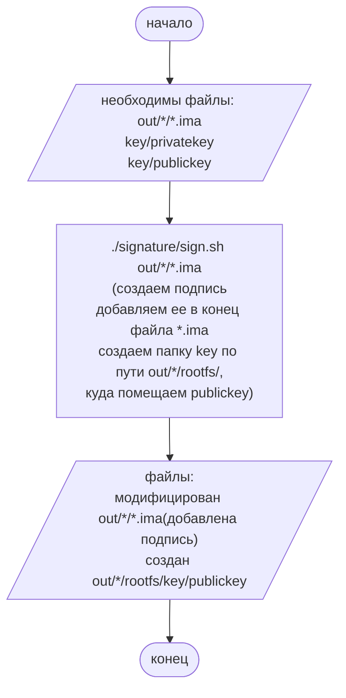
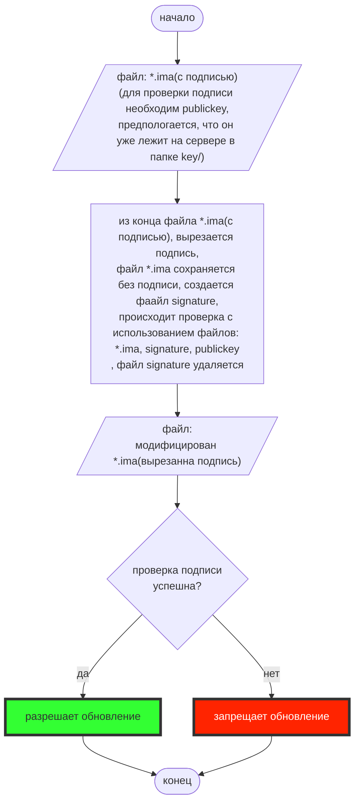

openssl genrsa -out privatekey 2048                                             создание закрытого ключа
openssl dgst -sha256 -sign privatekey -out readme.signature readme.txt          подпись
openssl rsa -in privatekey -outform PEM -pubout -out publickey                  генерация открытого ключа
openssl dgst -sha256 -verify publickey -signature readme.signature readme.txt   для проверки

## Оглавление

1. [Доверенное обновление BMC](#доверенное-обновление-bmc)
    * 1.1. [Скрипт для подписания файлов](#signsh-путь-signaturesignsh)
    * 1.2. [Проверка подписи на сервере](#проверка-подписи-на-сервере)

## Доверенное обновление BMC

### Скрипт для подписания файлов
#### sign.sh (путь signature/sign.sh)
#### Запуск (*-название прошивки)
```bash
./signature/sign.sh out/*/*.ima

```
#### Принцип работы

###### [К оглавлению](#Оглавление)
---
### Проверка подписи на сервере
### verify_signature (путь lib/flash/flashlib.cpp)
static int verify_signature(const char *name) - проверяет подпись, вызывает extracts_signature_in_separate_file

static int extracts_signature_in_separate_file(const char *source_path, long delete_len, const char *signature) - вырезает подпись из файла и помещает ее в отдельный файл

#### Принцип работы

###### [К оглавлению](#Оглавление)
---
