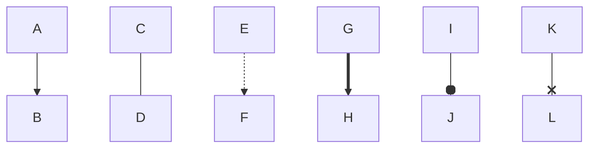

openssl genrsa -out privatekey 2048                                             создание закрытого ключа
openssl dgst -sha256 -sign privatekey -out readme.signature readme.txt          подпись
openssl rsa -in privatekey -outform PEM -pubout -out publickey                  генерация открытого ключа
openssl dgst -sha256 -verify publickey -signature readme.signature readme.txt   для проверки

